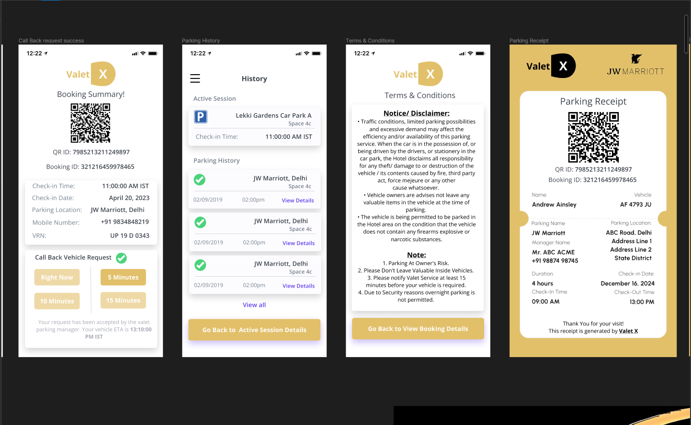

# valetX

A PWA app as parking assistant to manage parking place in hotels, restaurants etc. User can scan QR and can register using WhatsApp or website without any personal detail and a valet user will pick the car to the parking location. User also can request a vehicle callback from the parking location.

## Screenshots

### [Checkout All Screenshots](screenshots)
#
`#Reactjs` `#Redux` `#MUI` `#AdminPanel` `#fringerprintjs` `#QR code generator` `#QR scanner` `#Timeline View` `#Vehicle Check-in and Checkout` `#PDF export` `#Role base dynamic dashboard` `#Receipt Generation` `#Reports`
